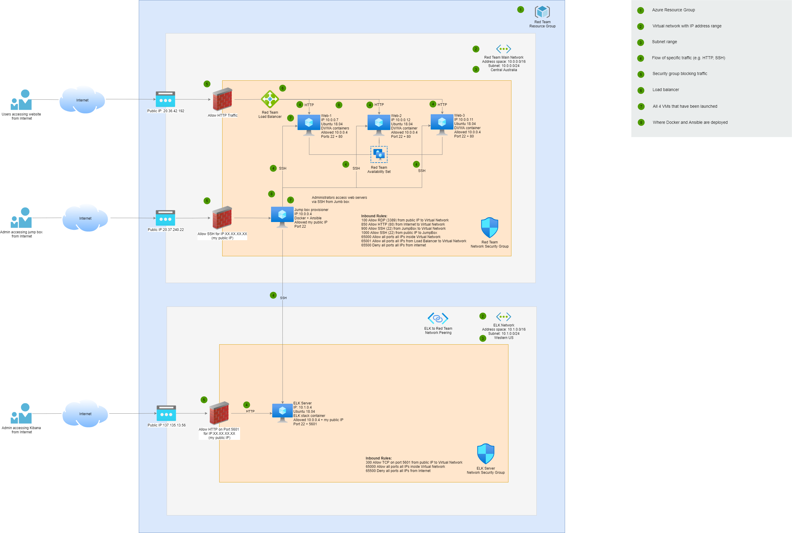
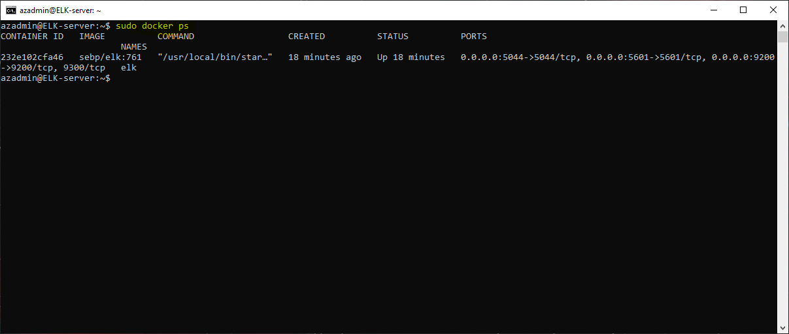

## Automated ELK Stack Deployment

The files in this repository were used to configure the network depicted below.

These files have been tested and used to generate a live ELK deployment on Azure. They can be used to either recreate the entire deployment pictured above. Alternatively, select portions of the playbook files may be used to install only certain pieces of it, such as Filebeat.

  - [ELK install playbook](https://github.com/gilleskern/uwa-bootcamp-project1/blob/main/Ansible/install-elk.yml)
  - [Filebeat playbook](https://github.com/gilleskern/uwa-bootcamp-project1/blob/main/Ansible/filebeat-playbook.yml)
  - [Metricbeat playbook](https://github.com/gilleskern/uwa-bootcamp-project1/blob/main/Ansible/metricbeat-playbook.yml)

This document contains the following details:
- Description of the Topology
- Access Policies
- ELK Configuration
  - Beats in Use
  - Machines Being Monitored
- How to Use the Ansible Build

### Description of the Topology

The main purpose of this network is to expose a load-balanced and monitored instance of DVWA, the D*mn Vulnerable Web Application.

Load balancing ensures that the application will be highly available, in addition to restricting access to the network.

What aspect of security do load balancers protect?\
The primary function of load balancers is to spread the traffic across multiple servers. If a server becomes unavailable due to a DDoS attack, 
load balancers will re-route requests to another server. in doing so, load balancers help to eliminate single points of failure, reduce the attack surface,
and make it harder to exhaust resources and saturate links.

What is the advantage of a jump box?\
The main advantage of a jump box is to hide an entire network from a potential attacker on the Internet. It also provides a secured access to the network
and allows for easy installation of software packages to different groups of computers.

Integrating an ELK server allows users to easily monitor the vulnerable VMs for changes to the event logs and system metrics.
- What does Filebeat watch for? 
  - Filebeat watches for log files or locations that the user specify.
- What does Metricbeat record? 
  - Metricbeat watches for metrics from the operating system and from services running on the server.

The configuration details of each machine may be found below.\
Use the [Markdown Table Generator](http://www.tablesgenerator.com/markdown_tables) to add/remove values from the table.

| Name                 | Function          | IP Address | Operating System |
|----------------------|-------------------|------------|------------------|
| Jump-Box-Provisioner | Gateway           | 10.0.0.4   | Linux (Ubuntu)   |
| Web-1                | Web Server        | 10.0.0.7   | Linux (Ubuntu)   |
| Web-2                | Web Server        | 10.0.0.12  | Linux (Ubuntu)   |
| Web-3                | Web Server        | 10.0.0.11  | Linux (Ubuntu)   |
| ELK-Server           | Monitoring Server | 10.1.0.4   | Linux (Ubuntu)   |

### Access Policies

The machines on the internal network are not exposed to the public Internet. 

Only the jump box machine can accept connections from the Internet. Access to this machine is only allowed from the following IP addresses:
- My public IP address (I am not going to tell you what it is!)

Machines within the network can only be accessed by SSH.
- Which machine did you allow to access your ELK VM? 
  - the Jump-Box-Provisioner
- What was its IP address? 
  - 20.37.240.22

A summary of the access policies in place can be found in the table below.

| Name                 | Publicly Accessible | Allowed IP Addresses |
|----------------------|---------------------|----------------------|
| Jump-Box-Provisioner | Yes                 | My Public IP         |
| Web-1                | No                  | 10.0.0.4             |
| Web-2                | No                  | 10.0.0.4             |
| Web-3                | No                  | 10.0.0.4             |
| ELK-Server           | No                  | 10.0.0.4             |

### Elk Configuration

Ansible was used to automate configuration of the ELK machine. No configuration was performed manually, which is advantageous because it allows
to configure multiples machines consistently and repeatedly.

The playbook implements the following tasks:
- Install docker.io
- Install python3-pip
- Increase virtual memory
- Download and launch a docker elk container
- Enable Docker service on boot

The following screenshot displays the result of running `docker ps` after successfully configuring the ELK instance.

### Target Machines & Beats
This ELK server is configured to monitor the following machines:
- Web-1 (10.0.0.7)
- Web-2 (10.0.0.12)
- Web-3 (10.0.0.11)

We have installed the following Beats on these machines:
- Filebeat
- Metricbeat

These Beats allow us to collect the following information from each machine:
- Filebeat collect log events, which we use to track suspicious traffic on the monitored servers. 
- Metricbeat collect information about operating system and services which help to detect if a server is behaving suspiciously.

### Using the Playbook
In order to use the playbook, you will need to have an Ansible control node already configured. Assuming you have such a control node provisioned: 

SSH into the control node and follow the steps below:
- Copy the playbook file to /etc/ansible.
- Update the hosts file to include the IP address of the ELK server
- Run the playbook, and navigate to Kibana (http://137.135.13.56:5601/app/kibana#/home) to check that the installation worked as expected.

Answer the following questions to fill in the blanks:
- Which file is the playbook? 
  - The playbook file is [install-elk.yml](https://github.com/gilleskern/uwa-bootcamp-project1/blob/main/Ansible/install-elk.yml)
- Where do you copy it? 
  - You need to copy it into the /etc/ansible directory.
- Which file do you update to make Ansible run the playbook on a specific machine? 
  - You need to update the hosts file (/etc/ansible/hosts)
- How do I specify which machine to install the ELK server on versus which to install Filebeat on? 
  - You create two different sections inside the host file one for the webservers and one for the ELK server.
  - Each section contains a name in square brackets (i.e. [webservers] or [elk])
  - Add the IP of the specific machines in the according section
- Which URL do you navigate to in order to check that the ELK server is running?
  - You navigate to tghe public IP of the ELK server on port 5601 (i.e. http://137.135.13.56:5601/app/kibana#/home)

_As a **Bonus**, provide the specific commands the user will need to run to download the playbook, update the files, etc._